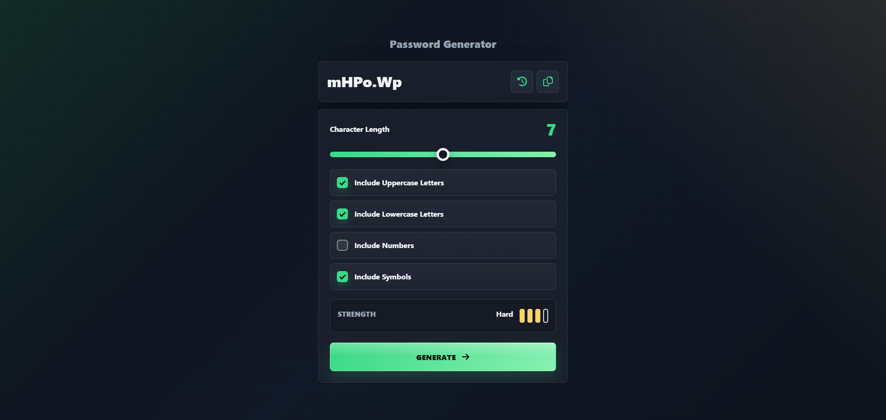

# Password Generator

Responsive password generator built with React. It lets users create random passwords, choose character groups, check password strength, copy generated passwords, and reuse recent session passwords.

Live demo: [Password Generator](https://ismailcubuk.github.io/PasswordGenerator/)



## Features

- Generate random passwords
- Choose password length
- Include uppercase letters
- Include lowercase letters
- Include numbers
- Include symbols
- View password strength
- Copy the generated password
- Open and copy recent passwords from the current session
- Responsive layout for desktop, tablet, and mobile screens

## Tech Stack

- React
- React Bootstrap
- Bootstrap
- Font Awesome
- CSS

## Project Structure

```text
src/
  Components/
    Alert/
    GenerateBody/
    GenerateShow/
    Header/
    RecentPasswords/
  Context/
    PasswordContext.js
  App.js
  index.css
  index.js
```
